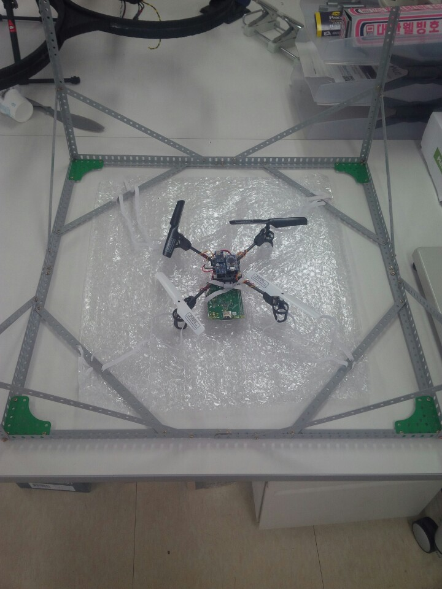

# 2015-10-17

새로운 드론 입양!!

### 진행상황
> 드론 부품 구매
- 작은 드론   : 7.4v 배터리, MPU9250 ( MPU9150 대체품 )
- 큰 드론    : 드론 다리 2세트, 날개 4세트

> 큰 드론 PID 미세조정

## issue

> 부품들아 빨리 와랏!

## 다음 할일

> 웹호스팅 구하기

> 컴파일할때 소스트리 구조 검토하기

# 2015-10-17

새로운 드론 입양!!

### 진행상황
> 기존 45cm 짜리 프레임에 셋팅 완료. 모터 컨트롤을 위한 기판 납땜 완료

> 안드로이드 앱 기능동작까지 완료..

> 라즈베리와 안드로이드 연동 완료. 직접 테스트까지 가능.. 다듬질만 하면 될 듯

## issue

> 드론을..어떤 것을 사용할 것인가.. 이대로 가도 될 것인가..

## 다음 할일
> 부품 구매 ( 드론 다리, 드론 날개 여유분 ) -> 팔콘샵

> 웹 호스팅 구매하기. 워드프레스 문서작업 시작할 것

# 2015-10-16

첫번째 드론 테스트.

### 진행상황
> 미니 드론 프레임에 만든 기판, 라즈베리파이 2, 배터리 등 장착

## issue

> 아두콥터에 라즈베리파이2 장착할 공간도 없고 무게를 버티지 못함..

> 최대 출력을 주었지만.. 3cm 정도 뜨나..? 그것도 호버링이 제대로 되지 못해서 ...망..

> 라즈베리파이2 하나 태워먹음...안녕...또르르

## 다음 할일
> 맨 처음 샀던 큰 드론... 그걸 사용해서 다시 해보쟈... 어짜피 이미 했던 작업.. 모터 돌리는거 까진 금방 할 듯

> 아두콥더를 계속 사용하려면... 고려해야할 점이 너무 많다..

# 2015-10-11
PID의 역습..

### 진행상황
> PID 다시 진행중. throttle 이 1000 일때 안정적인 범위를 찾음...1000 일때만...

> 통신코드 추가 완료 -> 랜설정만 되면 바로 테스트 예정

> PID 튜너 프로그램 만듬.. 실행중에 p, i, d, throttle 변경가능.

## issue

> 모터 출력에 따라 PID 가 다를수가 있나.. 1000에서는 잘 동작하던게 느린속도에서는 맞질 않는다.

> 튜너 프로그램에서 실행중에 i를 바꾸면..i는 누적값인데.. 이게 변경된게 적용이 될까...?

## 다음 할일
> PID pitch, roll 값... 처음부터 이게 맞는지... 처음부터 잘 살펴보자
> 라즈베리파이에 랜선, 무선랜 AP 동시에 동작할 수 있도록 설정방법 찾아야함.

# 2015-10-11

### 진행상황
> 호버링 안정화,,, 많이 나아진듯. 기존 아두이노 구매품과 비교해보니 거의 비슷한 정도.
 그래도 뭔가 불안. 이제 통신코드 추가하여 실제 띄워보고 컨트롤이 중요할 듯 싶다.

> 기판 납떔질 완료.....는 모터가 제대로 동작하지 않는다. 트랜지스터 문제로 예상. 수요일 교체 예정

## issue

> 모터 출력이 제대로 되지 않음. -> 새로 만든 기판. 트랜지스터 문제로 추측.

> 라즈베리파이를 연결할만한 공간이 되지 않음. 그 부분판 3D 프린터로 뜰 수 있나..?

### 다음 할일

> 통신코드 추가

> 트랜지스터 교체

# 2015-10-10

단축 호버링 성공,,, 4개 동시는 아직.....

### 진행상황
> 발견 내용 : MPU6050 calibration 2번하면 느려짐. 한번 테스트 하고 나서 MPU6050 재부팅 후 다시 테스트 할 것.

> 단축 호버링 성공.. 날개 두개씩 잡고 균형잡기 성공.. 뭔가 부들부들 한데 시간 지날수록 정확해지는듯.

> 밑에다 고무줄 걸고 날려보았지만.. 날개 4개는 무리.. PID 문제인가... 단축 좀더 보완하고 도전해야 할 듯.

> 단축 호버링 성공 PID

>|Kp|Ki|Kd|
|:--|:--|:--|
|0.54|0.02|0.12|

## issue

> pid... pid... 최적의 pid....

### 다음 할일

> 납땜납떔 새로운 보드 만들기..! 가볍게..라즈베리 자리 선정해서 올리기.

> PID 계속 삽질.

> 테스트 프레임 좀더 보완할 것.

# 2015-10-8

PID 상수만 찾으면 된다아?!

### 진행상황
> 드론 테스트용 프레임 제작 완료

> PID 라이브러리 제작 완료

> MPU6050 값 일어오는 부분 완료

> 테스트 유닛 작성 완료

> 테스트하는 방법

- 컨트롤 보드가 드론 위에 있으면 날개에 걸려서 아래에다가 걸쳐놓음.

- 아두이노 5, 6, 9 ,10 꽂는곳에 PWM 으로 라즈베리에서 모터 출력 넣어줄 것.
- MPU6050은 바닥에 빵판에 평평하게 놓은뒤 calibration 끝나고 이리저리 움직이면서 모터 속도 변화 관찰.

### issue

> MPU6050 DMP읽어오는 속도.. 갈수록 느려지며 오차누적으로 인해 PID도 영향을 받음.

> 그래서 지금 PID가 처음에는 정상적으로 동작하는 듯 하나 나중에는 한쪽으로 쏠림 현상이 일어남

> MPU6050 헤더 인클루드하는 부분 wiringPi 랑 깔끔하게 정리해야할 듯

### 다음 할일

> 기판 만들기 ( 트랜지스터랑 모터 연결.. 최대한 작게 깔끔하게. 기판에 MPU6050도 붙여야 함)

> PID 누적오차 수정 후 PID 상수 이건 계속 삽질해야 함

# 2015-10-7
결론 : softPWM 완료, Motor library frame 완료, 모터 동작 확인 완료

### 진행상황
> softPwm 을 통한 모터제어 -> 기존 보드의 TR 사용하여 제어 완료

> Motor 인터페이스 구성. 복붙해서 각 장치에 맞게 구현하면 됨...
- https://github.com/soma6th/DOSv1.0/commit/8e70b07a18e0c344d8cfaf220c6945574df05b1d

> 기존 보드에서 아두이노가 PWM 으로 모터 제어하는 부분에 라즈베리에서 PWM 4개 만들어서 넣어봄 -> 확인완료

> PWM 4개 모터제어용 핀 파형 확인..

> 테스트 코드 작성 완료.

### issue

### 다음 할일

> 테스트 프레임 제작

> 진우와 자이로센서값 받아오는 부분 머지하여 PID로 구현 -> 호버링 테스트

# 2015-10-6

### 진행상황
> 라즈베리파이 A+, 고무줄, 과학상자, 동글 구매 완료

> Superman 디렉토리구조 커밋 완료

### issue

### 다음 할일

> 모터 직접 제어 확인

> 아두이노 소스코드 분석....

# 2015-10-5

### 진행상황
> 아두이노 드론 PWM 출력 범위 확인함.

> 파일 디렉토리 구조 확정

> 일단 트랜지스터 갖고있는걸로 모터 돌아가나 확인해보기

### issue

### 다음 할일

> 트랜지스트 쪼그마한거랑 PCB 구매해서 작게 만들어보기

# 2015-10-3
 드디어 최대 범위를 찾음
### 진행상황
> software 로 PWM 만들때 주기를 클럭 그대로 받아서 사용. range 0~2500 까지 설정 가능 400hz, 2.5ms

> 이제 실제 라이브러리 제작 시작

### issue
> range 를 늘리니 처음 esc 세팅에 변화가 생김!!

> 15% 세팅시 더 낮은 듀티비에서 동작하나 최대치는 낮고 37% 세팅은 높은 듀티비에서 출력을 시작하며 최대치가 높다
 - 웃긴거는 동작범위는 같다는거 60칸 정도.. 이게 1ms 2ms 그 차이때문인듯

### 다음 할일
> LGPL 라이센스.. 와이어링파이 막 섞어써도 되는지..?

> WiringPi 처럼 라이브러리화

# 2015-10-2
 오실로스코프랑 친해지는중...
### 진행상황
> ESC 연결시 라파 뒈짐현상 해결... BEC.. 따로 전원 줄필요없다
>https://github.com/monibu1548/DronePi.git 작업용 깃 추가

비교표
case 1: 400Hz
동작범위가 17~18밖에 안된다..18은 이미 최대치이므로 오래돌리면 ESC 도 못버틸거고...
실질적으로 제어할수 있는 범위는 5 이내인듯... 제대로 제어가 될까.

case 2: 50Hz
동작범위 6~10 개노답

라즈베리파이 주기 계산
softPwmCreate()로 들어오는 (Range * 임의 정수) * 10^-6 = 400hz or 50hz

동작범위 늘리려면 Range를 늘리고 임의 정수를 줄여야 하는데 헤르츠 높을수록 범위가 많아진다.
490이 측정상 최대... 기존 컨트롤러에서는 400hz 사용하고있음.

불안하다.... 또르르

결론. 지금 ESC 는 50hz ~ 400Hz 까지 동작한다
ESC가 동작할수 있도록 세팅되는 듀티비는 15%, 38% 두 종류이며.. 데싯이나 메뉴얼에는 이게 최대치를  설정하는 거라는데... 15나 38퍼 모두 동작범위는 동일했다...
내가 지금 까먹은게 뭘까...빼놓은게 뭘까...

### issue
> 400Hz 만들기 위해 wiringPi 건들여야하나.. 최소화하자

### 다음 할일
> ESC 주파수 50Hz -> 400 Hz 로 변경할 것
> WiringPi 처럼 라이브러리화

# 2015-10-1
 와... 안전장치 안하고 모터돌렸다가 손가락 날아가는줄...
### 진행상황
> ESC 컨트롤 완료. ( 세팅전압,맥스전압 1.7v )

### issue
> 아직도 ESC 연결시 라파 뒈짐현상이 종종 발생한다...

> ESC 에서도 보면 5v가 나오는거같은데..충돌나는건가

### 다음 할일
> ESC Control 부분 라이브러리화... 와이어링파이 주기를 고쳐야되는데..어떤방법을쓸까..

> 고무줄이든 실이든 안전장치가 필요...!

# 2015-09-29
### 진행상황
> softPWM 출력 값은 제대로 출력됨..

> avr datasheet 확인

> wiringPi 분석

### issue
> 왜 그냥 PWM 쓰면 라파가 뒈짐...? 원래 안그랬는데...?

### 다음 할일
> ESC control

# 2015-09-28
### 진행상황
> wiringPi PWM 분석

### issue
>

### 다음 할일
> PWM 오실로스코프로 확인하기

# 2015-09-26

### 진행상황

> 1. 드론 해체작업
> 2. WiringPi 코드 분석

### issue

> 1.  ESC가 단순히 PWM 만으로 동작하는 것이 아니었다.. -> 초기화작업.. 이것도 데이터 시트가 있더라....하...데씻데씻
> 2. SoftPWM 이 realPWM 보다 성능이 떨어진다..?

### 다음 할일
> 1. 데싯보고 ESC 동작 방식 확인하기
> 2. softPWM raw 코드 확인하기
